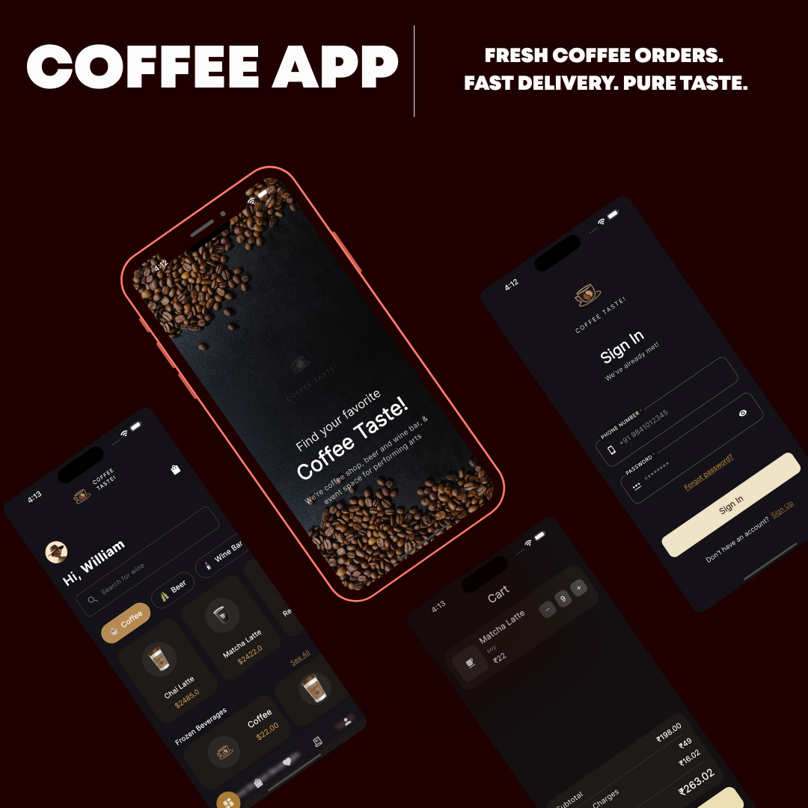

# CoffeeCafe

A modular, feature-based Flutter coffee app with clean architecture, Cubit state management, and API-friendly repositories. Built for scalability and easy future integration with REST/Firebase.



## Features
- Feature-first architecture (navigation, dashboard, search, categories, sections, product detail, cart)
- Custom bottom navigation bar, go_router shell navigation
- Dashboard hero with greeting, animated search hint
- Search with mock repository and result list
- Categories chips + animated horizontal lists
- Sections with headers and horizontal product rows
- Product Detail: header image, title/rating, expandable description, milk selection, quantity, add to cart
- Cart: tab in bottom navigation, badge count on header, swipe-to-delete, subtotal + delivery + taxes + grand total
- Centralized strings, assets, and colors (no hardcoded UI strings)
- DI via global BlocProviders, repositories behind interfaces ready for API/Firebase

## Architecture
- Core
  - `core/constants` – strings, assets, colors
  - `core/di` – global providers (Cubits with repository injection)
  - `core/routes` – app router configuration (go_router)
- Features (each has `models/`, `repositories/`, `cubit/`, `presentation/`)
  - navigation, dashboard, search, categories, sections, product_detail, cart
- State management: Cubit (flutter_bloc) with immutable states (Equatable)
- Repositories: interface-driven with mock implementations for now

## Getting Started
1. Prerequisites
   - Flutter 3.x
2. Install
   - `flutter pub get`
3. Run
   - `flutter run`
   - Web: `flutter run -d chrome`

## Project Structure (excerpt)
```
lib/
  core/
    constants/
    di/
    routes/
  features/
    navigation/
    dashboard/
    search/
    categories/
    sections/
    product_detail/
    cart/
```

## Tech Stack
- Flutter, Dart
- flutter_bloc (Cubit)
- go_router
- flutter_screenutil

## Roadmap
- Wishlist toggle
- Error/empty states across features
- API/Firebase integration for repositories
- More robust id mapping and route structure
